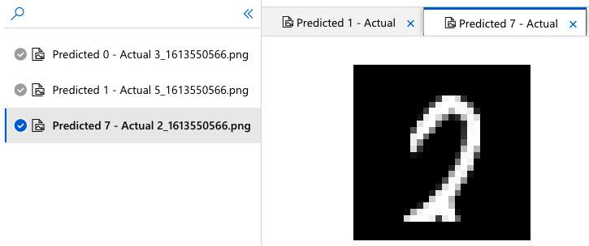

# Logging experiments

With `arcus-azureml`, we wrap the Azure ML SDK so that it becomes extremely easy to track and log the standard common metrics and results of experiments.  This makes it very powerful to find back and get an overview of the different trainings that get scheduled.  This section describes the actual logging capabilities for both interactive as scheduled experiments.


## Evaluate classifiers

When classifiers have been trained, it's important to add these metrics and evaluation results to the logging of the experiment.

The following piece of code can be executed for that (on the trainer):

```python
trainer.evaluate_classifier(model, X_test, y_test, show_roc = True, save_curves_as_images = True, class_names = ['valid', 'invalid'])   
```

This will generate and store the confusion matrix, add some loggings, such as accuracy and optionally perform the following logic below.

The `model` that you pass will be evaluated, using the test data (`X_test` & `y_test`).  
If it's a binary classifier, you can indicate to track the RoC curve (`show_roc`) in the metrics
When you're training classifiers, you can also save the training and loss curves as images by using the `save_curves_as_image` parameter
If you want to use the class labels (instead of the class integers), you can pass them as string array through the `class_names` parameter

An example of a confusion matrix and some basic logging:


## Evaluation of image classifiers

You can use the above methods for image classifiers, but Arcus also provides a way to add some image specifics:

```python
trainer.evaluate_image_classifier(model, X_test, y_test, show_roc = True, failed_classifications_to_save = 5, save_curves_as_images = True, class_names = ['valid', 'invalid'])   
```

This behaves exactly as the previous code snippet, but when passing the `failed_classifications_to_save` parameter, Arcus will automatically select that many incorrect predictions and add them in the run details, so you immediately can see some incorrect predictions and visually inspect what could be a reason for that.



## Saving of generated images

Sometimes, a model is not about classification, but about generating images (for example denoising, etc).  in that case, it's important to also log some generated images.  That's possible with the following code:

```python
trainer.save_image_outputs(X_test, y_test, y_pred, samples_to_save = 1)
```

What will happen with the above is that 3 correlated images (one from the test input (`X_test`), the desired output (`y_test`) and the predicted/generated output (`y_pred`)) will be stitched together in a new image that will be stored in the experiment.  